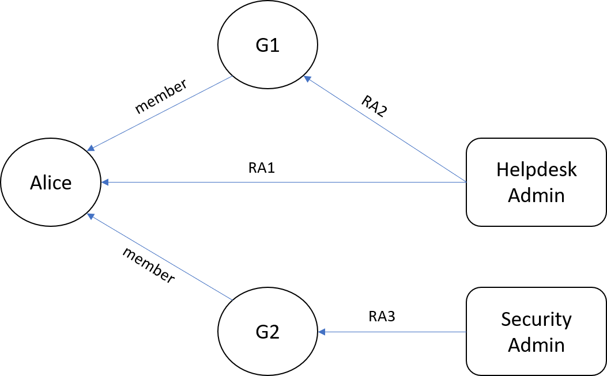

# Get list of direct and transitive unifiedRoleAssignments for a principal

Namespace: microsoft.graph

[!INCLUDE [beta-disclaimer](../../includes/beta-disclaimer.md)]

Get the list of direct and transitive [unifiedRoleAssignment](../resources/unifiedroleassignment.md) objects for a specific principal.

## Permissions

One of the following permissions is required to call this API. To learn more, including how to choose permissions, see [Permissions](/graph/permissions-reference).

|Permission type      | Permissions (from least to most privileged)              |
|:--------------------|:---------------------------------------------------------|
|Delegated (work or school account) | RoleManagement.Read.Directory, Directory.Read.All, RoleManagement.ReadWrite.Directory, Directory.ReadWrite.All, Directory.AccessAsUser.All, AND GroupMember.Read.All (if fetching transitive role assignmnts) |
|Delegated (personal Microsoft account) | Not supported.    |
|Application | RoleManagement.Read.Directory, Directory.Read.All, RoleManagement.ReadWrite.Directory, Directory.ReadWrite.All, AND GroupMember.Read.All (if fetching transitive role assignmnts) |

## HTTP request

<!-- { "blockType": "ignored" } -->

```http
GET /users/<user-id>/roleManagement/directory/transitiveRoleAssignments
```

## Optional query parameters

This method supports OData query parameters to help customize the response. For general information, see [OData query parameters](/graph/query-parameters).

## Request headers

| Name      |Description|
|:----------|:----------|
| Authorization | Bearer {token} |

## Request body

Do not supply a request body for this method.

## Response

If successful, this method returns a `200 OK` response code and the requested [unifiedRoleAssignment](../resources/unifiedroleassignment.md) object in the response body.

## Examples
In examples below, we will consider following set up - 


### Example 1 : Get all direct and transitive role assignments of a principal

#### Request

The following is an example of the request.


# [HTTP](#tab/http)
<!-- {
  "blockType": "request",
  "name": "get_unifiedroleassignment_all"
}-->

```msgraph-interactive
GET https://graph.microsoft.com/beta/users/{Alice's id}/roleManagement/directory/transitiveRoleAssignments
```
# [C#](#tab/csharp)
[!INCLUDE [sample-code](../includes/snippets/csharp/get-unifiedroleassignment-csharp-snippets.md)]
[!INCLUDE [sdk-documentation](../includes/snippets/snippets-sdk-documentation-link.md)]

# [JavaScript](#tab/javascript)
[!INCLUDE [sample-code](../includes/snippets/javascript/get-unifiedroleassignment-javascript-snippets.md)]
[!INCLUDE [sdk-documentation](../includes/snippets/snippets-sdk-documentation-link.md)]

# [Objective-C](#tab/objc)
[!INCLUDE [sample-code](../includes/snippets/objc/get-unifiedroleassignment-objc-snippets.md)]
[!INCLUDE [sdk-documentation](../includes/snippets/snippets-sdk-documentation-link.md)]

---


#### Response

The following is an example of the response.

> **Note:** The response object shown here might be shortened for readability. All the properties will be returned from an actual call.

<!-- {
  "blockType": "response",
  "truncated": true,
  "@odata.type": "microsoft.graph.unifiedRoleAssignment"
} -->

```http
HTTP/1.1 200 OK
Content-type: application/json

{
    "@odata.context": "https://graph.microsoft.com/v1.0/$metadata#roleManagement/directory/roleAssignments",
    "value": [
        {
            "id": "<RA1's ID>",
            "principalId": "<Alice's ID>",
            "directoryScopeId": "/",
            "roleDefinitionId": "<Helpdesk Admin Role Definition ID>"
        },
        {
            "id": "<RA2's ID>",
            "principalId": "<G1's ID>",
            "directoryScopeId": "/",
            "roleDefinitionId": "<Helpdesk Admin Role Definition ID>"
        },
        {
            "id": "<RA3's ID>",
            "principalId": "<G2's ID>",
            "directoryScopeId": "/administrativeUnits/205db3cc-a12a-4344-aebc-05580f7c378e",
            "roleDefinitionId": "<Security Admin Role Definition ID>"
        }
    ]
}
```

### Example 2: Get only transitive role assignments of a principal

#### Request

The following is an example of the request with the `$expand` query parameter.


# [HTTP](#tab/http)
<!-- {
  "blockType": "request",
  "name": "get_unifiedroleassignment_transitive"
}-->

```msgraph-interactive
GET https://graph.microsoft.com/beta/users/{Alice's id}/roleManagement/directory/transitiveRoleAssignments?$filter=principalId ne '<Alice's ID>'
```
# [C#](#tab/csharp)
[!INCLUDE [sample-code](../includes/snippets/csharp/get-unifiedroleassignment-csharp-snippets.md)]
[!INCLUDE [sdk-documentation](../includes/snippets/snippets-sdk-documentation-link.md)]

# [JavaScript](#tab/javascript)
[!INCLUDE [sample-code](../includes/snippets/javascript/get-unifiedroleassignment-javascript-snippets.md)]
[!INCLUDE [sdk-documentation](../includes/snippets/snippets-sdk-documentation-link.md)]

# [Objective-C](#tab/objc)
[!INCLUDE [sample-code](../includes/snippets/objc/get-unifiedroleassignment-objc-snippets.md)]
[!INCLUDE [sdk-documentation](../includes/snippets/snippets-sdk-documentation-link.md)]

---


#### Response

The following is an example of the response.
> **Note:** The response object shown here might be shortened for readability. All the properties will be returned from an actual call.

<!-- {
  "blockType": "response",
  "truncated": true,
  "@odata.type": "microsoft.graph.unifiedRoleAssignment"
} -->

```http
HTTP/1.1 200 OK
Content-type: application/json

{
    "@odata.context": "https://graph.microsoft.com/v1.0/$metadata#roleManagement/directory/roleAssignments",
    "value": [
        {
            "id": "<RA2's ID>",
            "principalId": "<G1's ID>",
            "directoryScopeId": "/",
            "roleDefinitionId": "<Helpdesk Admin Role Definition ID>"
        },
        {
            "id": "<RA3's ID>",
            "principalId": "<G2's ID>",
            "directoryScopeId": "/administrativeUnits/205db3cc-a12a-4344-aebc-05580f7c378e",
            "roleDefinitionId": "<Security Admin Role Definition ID>"
        }
    ]
}
```

### Example 3: Get only tenant-scoped direct and transitive role assignments of a principal

#### Request

The following is an example of the request with the `$expand` query parameter.


# [HTTP](#tab/http)
<!-- {
  "blockType": "request",
  "name": "get_unifiedroleassignment_tenantscoped"
}-->

```msgraph-interactive
GET https://graph.microsoft.com/beta/users/{Alice's id}/roleManagement/directory/transitiveRoleAssignments?$filter=directoryScopeId eq '/'
```
# [C#](#tab/csharp)
[!INCLUDE [sample-code](../includes/snippets/csharp/get-unifiedroleassignment-csharp-snippets.md)]
[!INCLUDE [sdk-documentation](../includes/snippets/snippets-sdk-documentation-link.md)]

# [JavaScript](#tab/javascript)
[!INCLUDE [sample-code](../includes/snippets/javascript/get-unifiedroleassignment-javascript-snippets.md)]
[!INCLUDE [sdk-documentation](../includes/snippets/snippets-sdk-documentation-link.md)]

# [Objective-C](#tab/objc)
[!INCLUDE [sample-code](../includes/snippets/objc/get-unifiedroleassignment-objc-snippets.md)]
[!INCLUDE [sdk-documentation](../includes/snippets/snippets-sdk-documentation-link.md)]

---


#### Response

The following is an example of the response.
> **Note:** The response object shown here might be shortened for readability. All the properties will be returned from an actual call.

<!-- {
  "blockType": "response",
  "truncated": true,
  "@odata.type": "microsoft.graph.unifiedRoleAssignment"
} -->

```http
HTTP/1.1 200 OK
Content-type: application/json

{
    "@odata.context": "https://graph.microsoft.com/v1.0/$metadata#roleManagement/directory/roleAssignments",
    "value": [
        {
            "id": "<RA1's ID>",
            "principalId": "<Alice's ID>",
            "directoryScopeId": "/",
            "roleDefinitionId": "<Helpdesk Admin Role Definition ID>"
        },
        {
            "id": "<RA2's ID>",
            "principalId": "<G1's ID>",
            "resourceScope": "/",
            "directoryScopeId": "/",
            "roleDefinitionId": "<Helpdesk Admin Role Definition ID>"
        }
    ]
}
```

<!-- uuid: 16cd6b66-4b1a-43a1-adaf-3a886856ed98
2019-02-04 14:57:30 UTC -->
<!-- {
  "type": "#page.annotation",
  "description": "Get transtive unifiedRoleAssignment",
  "keywords": "",
  "section": "documentation",
  "tocPath": ""
}-->
