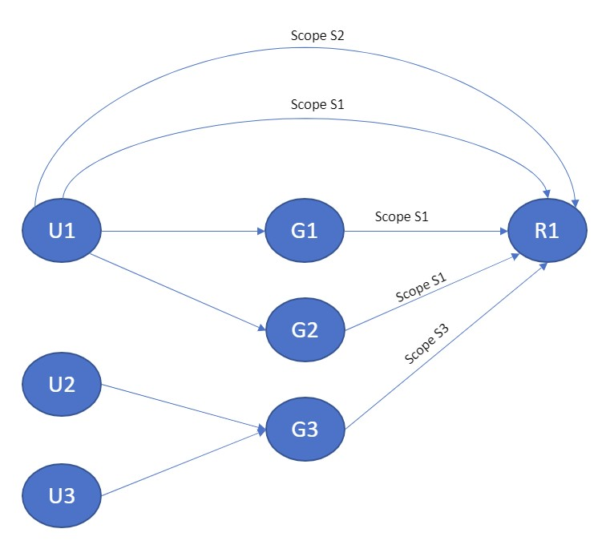

# List assigned principals

Namespace: microsoft.graph

[!INCLUDE [beta-disclaimer](../../includes/beta-disclaimer.md)]

Get a list of [directoryObjects](../resources/directoryObjects.md) assigned to a unifiedRoleDefinition object.

## Permissions

One of the following permissions is required to call this API. To learn more, including how to choose permissions, see [Permissions](/graph/permissions-reference).

|Permission type      | Permissions (from least to most privileged)              |
|:--------------------|:---------------------------------------------------------|
|Delegated (work or school account) | RoleManagement.Read.Directory, Directory.Read.All, RoleManagement.ReadWrite.Directory, Directory.ReadWrite.All, Directory.AccessAsUser.All, AND GroupMember.Read.All (if fetching transitive role assignmnts)    |
|Delegated (personal Microsoft account) | Not supported.    |
|Application | RoleManagement.Read.Directory, Directory.Read.All, RoleManagement.ReadWrite.Directory, Directory.ReadWrite.All, AND GroupMember.Read.All (if fetching transitive role assignmnts) |

## HTTP request

<!-- { "blockType": "ignored" } -->

```http
GET /roleManagement/directory/roleDefinitions/{id}/assignedPrincipals()
```

## Request headers

| Name      |Description|
|:----------|:----------|
| Authorization | Bearer {token} |

## Request body

Do not supply a request body for this method.

## Response

If successful, this method returns a `200 OK` response code and a collection of [directoryObjects](../resources/directoryObjects.md) in the response body.

## Examples

### Example 1: Get security principals assigned to a role directly across all scopes

#### Request

The following is an example of the request.


# [HTTP](#tab/http)
<!-- {
  "blockType": "request",
  "name": "get_assignedPrincipals_direct"
}-->

```msgraph-interactive
GET https://graph.microsoft.com/beta/roleManagement/directory/roleDefinitions/62e90394-69f5-4237-9190-012177145e10/assignedPrincipals()
```
# [C#](#tab/csharp)
[!INCLUDE [sample-code](../includes/snippets/csharp/get-roledefinitions-csharp-snippets.md)]
[!INCLUDE [sdk-documentation](../includes/snippets/snippets-sdk-documentation-link.md)]

# [JavaScript](#tab/javascript)
[!INCLUDE [sample-code](../includes/snippets/javascript/get-roledefinitions-javascript-snippets.md)]
[!INCLUDE [sdk-documentation](../includes/snippets/snippets-sdk-documentation-link.md)]

# [Objective-C](#tab/objc)
[!INCLUDE [sample-code](../includes/snippets/objc/get-roledefinitions-objc-snippets.md)]
[!INCLUDE [sdk-documentation](../includes/snippets/snippets-sdk-documentation-link.md)]

---


#### Response

The following is an example of the response.

> **Note:** The response object shown here might be shortened for readability. All the properties will be returned from an actual call.

<!-- {
  "blockType": "response",
  "truncated": true,
  "@odata.type": "microsoft.graph.directoryObject",
  "isCollection": true
} -->

```http
HTTP/1.1 200 OK
Content-type: application/json

{
    "@odata.context": "https://graph.microsoft.com/beta/$metadata#directoryObjects",
    "value": [
      {
          "@odata.type": "#microsoft.graph.user",
          "id": "6c62e70d-f5f5-4b9d-9eea-ed517ed9341f",
          "displayName": "User 1",
          "userPrincipalName": "user1@contoso.com"
      },
      {
          "@odata.type": "#microsoft.graph.group",
          "id": "86b38db7-6e8b-4ad2-b2aa-ced7f09486c1",
          "displayName": "Group 1"
      },
      {
          "@odata.type": "#microsoft.graph.group",
          "id": "182351a6-d974-4d18-88ae-8a148da44cd2",
          "displayName": "Group 2"
      },
      {
          "@odata.type": "#microsoft.graph.group",
          "id": "b93d5379-a464-4db5-b8e1-694910f1e11e",
          "displayName": "Group 3"
      }
    ]
    
}
```

### Example 2: Get users assigned directly to a role only at a particular scope

#### Request

The following is an example of the request.


# [HTTP](#tab/http)
<!-- {
  "blockType": "request",
  "name": "get_assignedPrincipals_direct_scoped"
}-->

```msgraph-interactive
GET https://graph.microsoft.com/beta/roleManagement/directory/roleDefinitions/62e90394-69f5-4237-9190-012177145e10/assignedPrincipals(directoryScopeId='/administrativeUnit/d67eba75-6337-4fb8-9f54-36fc5c890450')/microsoft.graph.user
```
# [C#](#tab/csharp)
[!INCLUDE [sample-code](../includes/snippets/csharp/get-roledefinitions-csharp-snippets.md)]
[!INCLUDE [sdk-documentation](../includes/snippets/snippets-sdk-documentation-link.md)]

# [JavaScript](#tab/javascript)
[!INCLUDE [sample-code](../includes/snippets/javascript/get-roledefinitions-javascript-snippets.md)]
[!INCLUDE [sdk-documentation](../includes/snippets/snippets-sdk-documentation-link.md)]

# [Objective-C](#tab/objc)
[!INCLUDE [sample-code](../includes/snippets/objc/get-roledefinitions-objc-snippets.md)]
[!INCLUDE [sdk-documentation](../includes/snippets/snippets-sdk-documentation-link.md)]

---


#### Response

The following is an example of the response.

> **Note:** The response object shown here might be shortened for readability. All the properties will be returned from an actual call.

<!-- {
  "blockType": "response",
  "truncated": true,
  "@odata.type": "microsoft.graph.directoryObject",
  "isCollection": true
} -->

```http
HTTP/1.1 200 OK
Content-type: application/json

{
  "@odata.context": "https://graph.microsoft.com/v1.0/$metadata#directoryObjects",
  "value": [
    {
        "@odata.type": "#microsoft.graph.user",
        "id": "6c62e70d-f5f5-4b9d-9eea-ed517ed9341f",
        "displayName": "User 1",
        "userPrincipalName": "user1@microsoft.com"
    }
  ]
    
}
```

### Example 3: Get direct and transitive principals assigned to a role across all scopes

#### Request

The following is an example of the request.


# [HTTP](#tab/http)
<!-- {
  "blockType": "request",
  "name": "get_assignedPrincipals_transitive"
}-->

```msgraph-interactive
GET https://graph.microsoft.com/beta/roleManagement/directory/roleDefinitions/62e90394-69f5-4237-9190-012177145e10/assignedPrincipals(transitive=true)
```
# [C#](#tab/csharp)
[!INCLUDE [sample-code](../includes/snippets/csharp/get-roledefinitions-csharp-snippets.md)]
[!INCLUDE [sdk-documentation](../includes/snippets/snippets-sdk-documentation-link.md)]

# [JavaScript](#tab/javascript)
[!INCLUDE [sample-code](../includes/snippets/javascript/get-roledefinitions-javascript-snippets.md)]
[!INCLUDE [sdk-documentation](../includes/snippets/snippets-sdk-documentation-link.md)]

# [Objective-C](#tab/objc)
[!INCLUDE [sample-code](../includes/snippets/objc/get-roledefinitions-objc-snippets.md)]
[!INCLUDE [sdk-documentation](../includes/snippets/snippets-sdk-documentation-link.md)]

---


#### Response

The following is an example of the response.

> **Note:** The response object shown here might be shortened for readability. All the properties will be returned from an actual call.

<!-- {
  "blockType": "response",
  "truncated": true,
  "@odata.type": "microsoft.graph.directoryObject",
  "isCollection": true
} -->

```http
HTTP/1.1 200 OK
Content-type: application/json

{
  "@odata.context": "https://graph.microsoft.com/v1.0/$metadata#directoryObjects",
  "value": [
      {
          "@odata.type": "#microsoft.graph.user",
          "id": "6c62e70d-f5f5-4b9d-9eea-ed517ed9341f",
          "displayName": "User 1",
          "userPrincipalName": "user1@contoso.com"
      },
      {
          "@odata.type": "#microsoft.graph.user",
          "id": "86b38db7-6e8b-4ad2-b2aa-ced7f09486c1",
          "displayName": "User 2"
      },
      {
          "@odata.type": "#microsoft.graph.user",
          "id": "182351a6-d974-4d18-88ae-8a148da44cd2",
          "displayName": "User 3"
      },
      {
          "@odata.type": "#microsoft.graph.user",
          "id": "b93d5379-a464-4db5-b8e1-694910f1e11e",
          "displayName": "User 4"
      }
  ]
    
}
```

### Example 4: Count principals assigned to a role directly or transitively

Consider following set up - 



#### Request

The following is an example of the request.


# [HTTP](#tab/http)
<!-- {
  "blockType": "request",
  "name": "get_assignedPrincipals_transitive_count"
}-->

```msgraph-interactive
GET https://graph.microsoft.com/beta/roleManagement/directory/roleDefinitions/62e90394-69f5-4237-9190-012177145e10/assignedPrincipals(transitive=true)/$count
```
# [C#](#tab/csharp)
[!INCLUDE [sample-code](../includes/snippets/csharp/get-roledefinitions-csharp-snippets.md)]
[!INCLUDE [sdk-documentation](../includes/snippets/snippets-sdk-documentation-link.md)]

# [JavaScript](#tab/javascript)
[!INCLUDE [sample-code](../includes/snippets/javascript/get-roledefinitions-javascript-snippets.md)]
[!INCLUDE [sdk-documentation](../includes/snippets/snippets-sdk-documentation-link.md)]

# [Objective-C](#tab/objc)
[!INCLUDE [sample-code](../includes/snippets/objc/get-roledefinitions-objc-snippets.md)]
[!INCLUDE [sdk-documentation](../includes/snippets/snippets-sdk-documentation-link.md)]

---


#### Response

The following is an example of the response.

> **Note:** The response object shown here might be shortened for readability. All the properties will be returned from an actual call.

<!-- {
  "blockType": "response",
  "truncated": true,
  "@odata.type": "microsoft.graph.directoryObject",
  "isCollection": true
} -->

```http
HTTP/1.1 200 OK
Content-type: text/plain

6
```

#### Some other examples in above scenario
|HTTP call|Output|
|-|-|
|`https://graph.microsoft.com/v1.0/roleManagement/directory/roleDefinitions/{id}/assignedPrincipals(transitive=false)/$count`|4<br>(U1, G1, G2, G3)|
|`https://graph.microsoft.com/v1.0/roleManagement/directory/roleDefinitions/{id}/assignedPrincipals(transitive=true)/$count`|6<br>(U1, U2, U3, G1, G2, G3)|
|`https://graph.microsoft.com/v1.0/roleManagement/directory/roleDefinitions/{id}/assignedPrincipals(transitive=false)/microsoft.graph.user/$count`|1<br>(U1)|
|`https://graph.microsoft.com/v1.0/roleManagement/directory/roleDefinitions/{id}/assignedPrincipals(transitive=true)/microsoft.graph.user/$count`|3<br>(U1, U2, U3)|
|`https://graph.microsoft.com/v1.0/roleManagement/directory/roleDefinitions/{id}/assignedPrincipals(transitive=false)/microsoft.graph.group/$count`|3<br>(G1, G2, G3)|
|`https://graph.microsoft.com/v1.0/roleManagement/directory/roleDefinitions/{id}/assignedPrincipals(transitive=true)/microsoft.graph.group/$count`|3<br>(G1, G2, G3)|

<!-- uuid: 16cd6b66-4b1a-43a1-adaf-3a886856ed98
2019-02-04 14:57:30 UTC -->
<!-- {
  "type": "#page.annotation",
  "description": "List assigned principals",
  "keywords": "",
  "section": "documentation",
  "tocPath": ""
}-->
